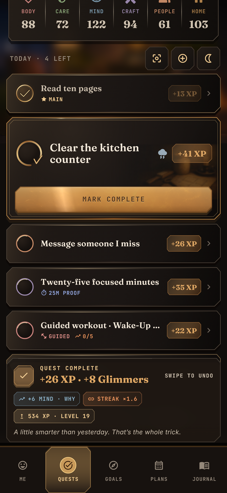
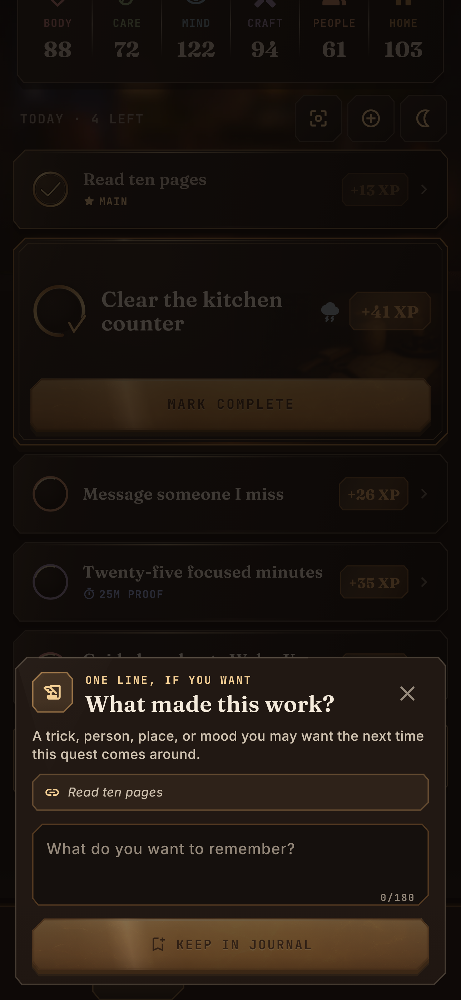
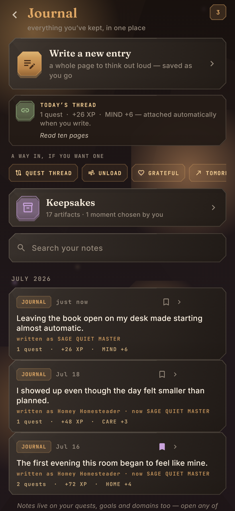
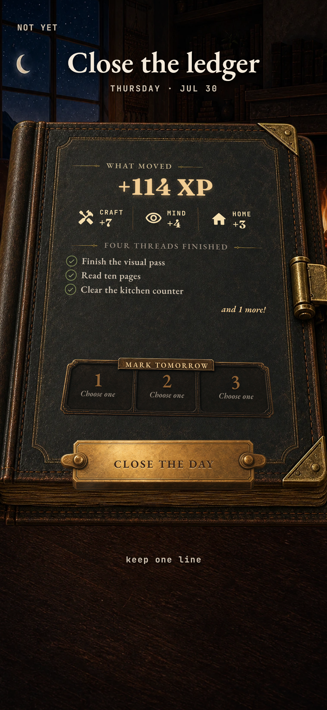
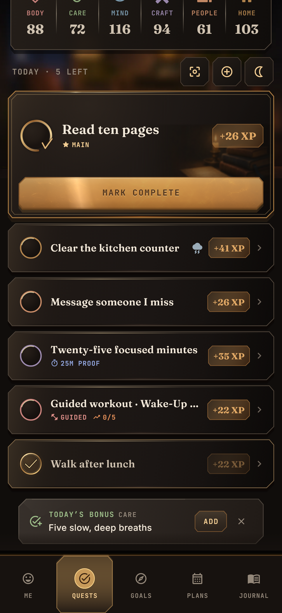

# Morrowloom Journal + Phone Performance Audit

Date: 2026-08-01
Scope: Quest completion → optional reflection → Journal recall, night-ledger
reflection, and the rendering/feedback systems active during phone use.
Target: 430 × 932 primary phone, 320 × 568 at 1.3× text, WCAG 2.2 AA-oriented
semantics and motion preferences, and release-mode mobile rendering.

## Outcome

The Journal now has a low-friction reason to exist beside Notes: after a Quest,
the person may keep one sentence while Morrowloom automatically preserves the
Quest, XP, domain movement, goals, build title, streak, and energy around it.
The same optional door appears at night without becoming another required
ledger section.

The scoped final screens have no open visible P0 or P1 issue. One P2 validation
gate remains: real iPhone/TestFlight frame pacing, haptics, sound, sensors, and
thermal behavior cannot be certified from Windows or screenshot tests.

## Baseline finding

The existing Journal was already meaningfully differentiated—Today’s Thread,
Patterns, Chronicle, Then & Now, searchable entries, keepsakes, and frozen day
context were strong. The weak link was capture: Quest completion ended at the
reward rail, while reflective writing required a later full-editor detour.

## Audited journey

1. **Complete a Quest — healthy.** The earned receipt remains readable and
   now offers one quiet secondary action: `KEEP ONE LINE · OPTIONAL`. It does
   not compete with the Quest’s primary gold completion action.

   

2. **Open the ten-second capture — healthy.** The receipt pauses and disappears
   so the private book-cloth sheet owns the modal layer. The prompt is specific
   to the completed Quest, the attached context is visible, and `Not now` is
   immediate.

   

3. **Return to Journal — strong.** The saved line appears as ordinary editable
   writing. Today’s Thread and the entry both show the automatically attached
   evidence (`1 quest · +26 XP · MIND +6`) without asking the person to tag or
   maintain metadata.

   

4. **Close the night ledger — healthy.** `CLOSE THE DAY` remains the physical
   primary action. `keep one line` is a quiet footer action rather than a new
   block squeezed inside the printed folio.

   

5. **Keep a night line — healthy.** The same capture language returns over the
   dimmed ledger, tied to the day’s finished threads. Saving does not close the
   ritual; the footer becomes `keep another line` afterward.

   

6. **Scroll the Quest board — visually healthy; hardware check remains.** The
   cards stay crisp over a progressively softened authored room. The effect is
   now a registered pre-softened plate instead of a live blur over the animated
   room.

   

## Performance findings and resolutions

| Finding | Resolution |
| --- | --- |
| All five illustrated destinations were built and decoded on the first Quest frame. | Each tab now builds on first visit, stays alive afterward, and mutes hidden tickers. |
| Phone tilt could publish light and camera changes at display rate. | Light is capped near 30 updates/sec; the heavier camera is near 30 natively and about 24 on web. |
| Quest scroll repeatedly blurred the full animated room. | A deterministic 1024 × 603 softened room plate fades over the live room only after scrolling starts. |
| Supporting pages and routines used large live scroll blurs. | They use warm value veils over already-authored soft-focus plates. |
| Fire, motes, and sensor motion could all rebuild at unrelated high rates. | Global motes are ~12 fps, Quest fire 12 fps web / 20 fps native, routine fire ~18 fps, with repaint boundaries retained. |
| Dock selection acknowledged only after tap release. | Dock controls now depress, tick, and haptically acknowledge pointer-down; scrolling cancels the press and action still commits on a valid tap. |
| The completion receipt could overlap and intercept the reflection modal. | The receipt pauses, becomes invisible and non-interactive during the sheet, then resumes for the saved confirmation. |

## Accessibility and trust checks

- The one-line path is optional at both entry points and has an explicit
  `Not now`; it never blocks completion or day close.
- Journal text remains editable and private-first; automatic context is quiet
  evidence, not required form fields.
- The sheet scrolls internally when a keyboard or large text reduces the
  available height.
- The 320 × 568, 1.3×-text reward/sheet path passes without overflow.
- Reduce Motion parks the room/fire systems on composed stills.
- Controls retain semantic labels; a screen-reader pass on physical iOS remains
  part of the release-device gate.

## Verification

- `flutter analyze`: pass, no issues.
- `flutter test`: pass, 127 tests.
- Current production screenshot stories: pass and opened for visual review.
- `flutter build web --release`: pass.
- Local release preview: HTTP 200 at `http://127.0.0.1:4173/`.
- Android release build: not run because this machine has no Android SDK.
- iOS/TestFlight build: not possible from Windows; physical iPhone release
  testing remains required before claiming final frame pacing.

Phone-friendly review sheet:
`design/comparisons/2026-08-01/journal-and-phone-performance-pass.webp`
