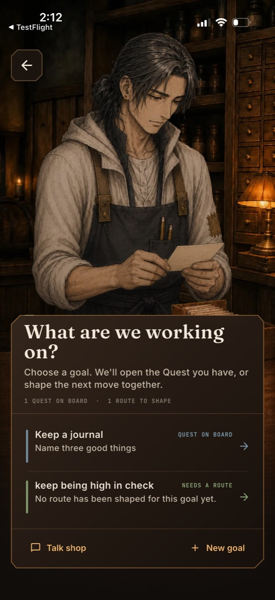
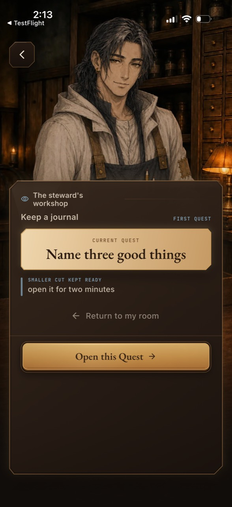
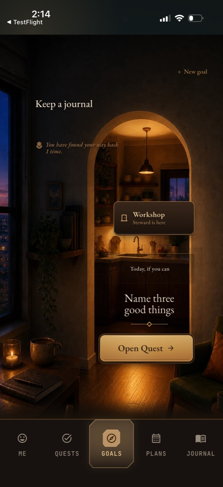

# Build 36 owner-phone audit

Date: August 30, 2026

## Audit scope

Combined product and accessibility audit of the Build 36 Goals return,
Workshop register, and first-Quest Workshop states shown on the owner's
physical iPhone. The three photographs below are the exact owner-supplied
TestFlight evidence. This audit does not claim measured iPhone colorimetry,
VoiceOver behavior, touch comfort, or performance beyond what the still images
and the owner's report establish.

## Owner correction

> "a lot of the fainter/smaller/less contrasting color writing is kind of hard to read, also as gorgeous as the goals page is right now i went into it and it didn’t add anything new to the app. also the chat is meant to be like a “get to know this character” kind of thing; not learn more about the app. have a chance to have his personality shine. also, i think the app ironically enough hasn’t been made good enough for users like myself: i have a bunch of quests up everyday and only actually do some of them, using the others as inspiration for if i have extra time or energy"

This supersedes the prior conclusion that the optional `Talk shop` mechanics
answers were an accepted character-depth layer. It also rejects the assumption
that a beautiful Goal-to-current-Quest handoff is sufficient ongoing value for
Goals.

## User goal and accessibility target

Use a crowded everyday Quest board without having to pretend every visible
Quest is a commitment; choose a small field for today while retaining other
Quests as optional inspiration; return to Goals for that useful decision; and
talk with the Steward because he is a person worth knowing rather than a help
article. All essential state, instructions, and controls must remain comfortably
readable on the physical phone.

## Steps

### 1. Returnable Workshop register — structurally healthy, meaning too faint

The room, character, and lower-counter register form one coherent frame. The
goal names and primary actions read. The summary, statuses, secondary action
copy, and quiet mechanics labels are substantially smaller and fainter even
though they carry useful state. `Talk shop` then leads to app-mechanics advice,
so the character's strongest optional doorway has the wrong purpose.

Health: needs revision.

### 2. First-Quest Workshop — strong decision object, weak supporting hierarchy

The Quest offer and gold action are clear. `FIRST QUEST`, `CURRENT QUEST`, the
smaller-cut label, and `Return to my room` are treated like decorative metadata
despite explaining the decision and its escape. The large empty lower register
also makes the information feel sparse rather than purposefully calm.

Health: needs revision.

### 3. Goals return — gorgeous threshold, duplicated product job

The authored apartment threshold is visually successful. The live copy over the
room is not: the return evidence, Workshop status, cue, and `New goal` are too
small or too close in value to the art behind them. More importantly, the
screen's only strong action opens the same current Quest already available on
the Quest board. It does not help a person decide which of many daily Quests
matter and which are merely available if the day has room.

Health: beautiful but product-incomplete.

## Strengths to preserve

- The apartment-to-Workshop spatial story and the Steward's five restrained
  work poses.
- Explicit Workshop acceptance as the only first-Quest creation boundary.
- One luminous action per state and the dark walnut / amber material system.
- Every scheduled Quest remains available and can earn normal progress.
- The no-guilt contract: unfinished optional work is not failure, debt, or a
  reason to reduce rewards already earned.

## Structural risks

1. Goals adds ceremony around one Quest without helping with ordinary capacity.
2. The Quest board calls the entire scheduled pool `LEFT`, which converts an
   inspiration shelf into an implicit obligation.
3. The existing dated top-three model is hidden in tomorrow/night and Gentle
   Mode flows instead of serving ordinary days.
4. Steward conversation is coupled rhetorically to route mechanics even though
   it correctly avoids mutating route state.

## Accessibility risks

1. `Type.minLabel` says 11sp is the floor, but the affected surfaces override
   it with 7.8–10.6sp live text.
2. `Palette.textLo` is only about 4.03:1 against a representative lighter warm
   surface (`#3B281B`) before texture, translucency, or antialiasing.
3. Meaningful art-backed text clamps text scaling and has no reliable local
   contrast plane in several positions.
4. Still photographs cannot prove VoiceOver order, Increased Contrast,
   Reduced Transparency, or real touch target comfort.

## Bounded correction

- Make the existing date-scoped top-three model an ordinary `Choose today`
  action in Goals. The chosen field is small; all other scheduled Quests remain
  visible in an `Open if it fits` shelf.
- On Quests, separate hard dated commitments, today's chosen field, and optional
  inspiration. When a field exists, completing commitments plus that field is
  enough for the day; optional completions remain fully rewarded.
- Replace route-advice chat with stable character-first questions that reveal
  the Steward through his boundaries, objects, and manner. Do not add a name,
  biography, affinity meter, praise loop, or Quest gate.
- Raise meaningful labels to at least 11sp, supporting prose to at least 13sp,
  brighten the quiet text token to retain at least 4.5:1 on the lightest common
  warm surface, and add dependable local contrast behind art-backed copy.

## Evidence limits and next proof

The decisive next proof is an end-to-end rendered slice: choose three from a
crowded eight-Quest day in Goals, see those three lead the Quest board while the
other five remain openly optional, complete the chosen field without penalty
from the shelf, and hold a character-first Steward exchange with no GoalPlan or
Quest mutation. Capture 430×932 and 320×568 at 1.5× text, plus Reduced Motion,
before preparing another TestFlight build.
